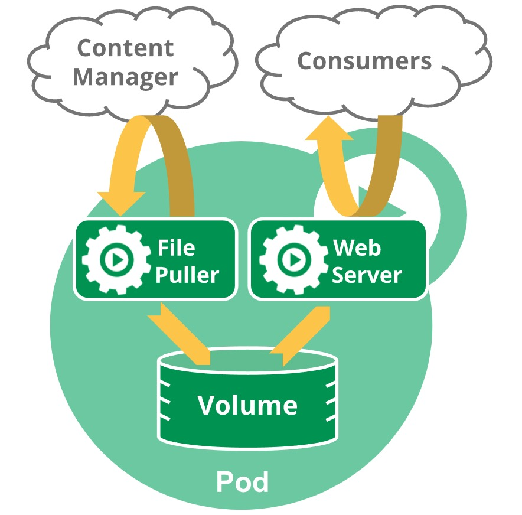

# Pod 生命周期

本页描述 Pod 的生命周期。Pod 遵循一个预定义的生命周期，起始于 `Pending` 阶段，如果至少其中有一个主要容器正确启动，则进入 `Running`，之后取决于 Pod 中是否有容器以失败状态结束而进入 `Succeeded` 或 `Failed` 阶段。

在 Pod 运行期间，`kubelet` 能够重启容器以处理一些失效场景。在 Pod 内部，Kubernetes 跟踪不同容器的状态，并确定使 Pod 重新变得健康所需要采取的动作。

在 Kubernetes API 中，Pod 包含规范部分和实际状态部分。Pod 对象的状态包含了一组 Pod 状况（**Conditions**）。如果应用需要的话，也可以向其中注入自定义的就绪信息。

Pod 在其生命周期中只会被调度一次。一旦 Pod 被调度到某个节点，Pod 会一直在该节点运行，直接 Pod 停止或者被终止。

## Pod 寿命

与单个应用程序容器一样，Pod 被认为是相对短暂的（不是长期存在的）实体。Pod 会被创建并赋予一个唯一的 ID（UID），并被调度到节点，并在终止（根据重启策略）或删除之前运行在该节点上。

如果节点宕机，调度到该节点的 Pod 也被计划在给定超时期限结束后删除。

Pod 自身不具备自愈能力。如果 Pod 被调度到某个节点，但该节点之后失效，Pod 会被删除；类似地，Pod 无法在因节点资源耗尽或者节点维护而被驱逐期间继续存活。Kubernetes 使用一种高级抽象秋管理这些相对而言可随时丢弃的 Pod 实例，它被称为控制器。

任何给定的 Pod（由 UID 定义）从不会被 “重新调度（_rescheduled_）”到不同的节点；但是，Pod 可以被一个新的、几乎相同的 Pod 替换掉。如果需要，新 Pod 名字可以不变，但是其 UID 仍然是不同的。

如果某个对象声称，其寿命与某 Pod 神秘顾客，例如存储卷，这就意味着该对象在此 Pod（UID 相同）存在期间也一直存在。如果 Pod 因为任何原因被删除，甚至某个完全相同的替代 Pod 被创建时，这个相关的对象也会被删除并重建。



一个包含多个容器的 Pod 中包含一个用来拉取文件的程序和一个 Web 服务器，无使用持久卷作为容器间共享的存储。

## Pod 阶段 <a href="#waiting" id="waiting"></a>

Pod 的 `status` 字段 是一个 PodStatus 对象，其中包含一个 `phase` 字段。

Pod 的阶段（Phase）是 Pod 在其生命周期中所处位置的简单宏观概述。该阶段并不是对容器或 Pod 状态的综合汇总，也不是为了成为完整的状态机。

Pod 阶段的数量和含义是严格定义的。除了本文档中列举的内容外，不应再假定 Pod 有其他的 `phase` 值。

`phase` 字段：

| **阶段**    | **描述**                                                                           |
| --------- | -------------------------------------------------------------------------------- |
| Pending   | Pod 已被 Kubernetes 集群接受，但有一个或多个容器尚未创建并准备好运行。此阶段包括 Pod 等待调度所花费的时间以及通过网络下载镜像所花费的时间。 |
| Running   | Pod 已绑定到一个节点，并且所有容器均已创建。至少有一个容器正在运行，或者正在启动或重启的过程中。                               |
| Succeeded | Pod 中所有容器都已成功终止，且不会再重启。                                                          |
| Failed    | Pod 中所有容器都已终止，并且至少有一个容器因故障而终止。也就是说，容器要么以非 0 状态退出，要么被系统终止。                        |
| Unknown   | 因为某些原因无法取得 Pod 状态。这种情况通常是因为与 Pod 所在节点通信出错而导致。                                    |

如果节点宕机或与集群中其他节点失联，Kubernetes 会实施一种策略，将失去的节点上运行的所有 Pod 的 `phase` 设置为 `Failed`。

## 容器状态

Kubernetes 会跟踪 Pod 中每个容器的状态，就像跟踪 Pod 阶段一样。可以使用容器生命周期回调来在容器生命周期中的特定时间点触发事件。

一旦调度器将 Pod 分派给某个节点，`kubelet` 就通过容器运行时开始为 Pod 创建容器。容器的状态有三种：

* `Waiting`（等待）
* `Running`（运行中）
* `Terminated`（已终止）

要检查 Pod 中容器的状态，可以使用 `kubectl describe pod <pod name>`命令。其输出中包含了 Pod 每个容器的状态。

每种状态的含义如下：

### <mark style="color:orange;">Waiting</mark>（等待） <a href="#waiting" id="waiting"></a>

处于 `Waiting` 状态的容器仍在运行它要完成启动所需要的操作，例如：从某个容器镜像仓库拉取镜像，或者应用 Secret 数据等。当使用 `kubelet` 来查询包含 `Waiting` 状态的容器的 Pod 时，也会看到一个 `Reason` 字段，其中会给出容器处于该状态的原因。

### <mark style="color:orange;">Running</mark>（运行中） <a href="#running" id="running"></a>

`Running` 状态表里容器正在执行状态并且没有故障发生。如果配置了 `postStart` 回调，那么该回调也已完成且执行成功。如果使用 `kubelet` 来查询包含 `Running` 状态的容器的 Pod 时，会看到关于容器进入该状态的信息。

### <mark style="color:orange;">Terminated</mark>（已终止） <a href="#terminated" id="terminated"></a>

处于 `Terminated` 状态的容器已经开始执行，或者执行完成，或者由于某种原因失败。如果使用 `kubelet` 来查询包含 `Terminated` 状态的容器的 Pod 时，会看到容器进入此状态的原因、退出代码，以及容器执行期间的起止时间。

如果容器配置了 `preStop` 回调，则该回调会在容器进入 `Terminated` 状态之前执行。

## 容器重启策略

Pod 的 `spec` 字段中有一个 `restartPolicy` 字段，其值包含 Always、OnFailure 和 Never。默认是 Always。

`restartPolicy` 适用于 Pod 中的所有容器。`restartPolicy` 仅针对同一节点上的 `kubelet` 的容器重启动作。当 Pod 中的容器退出时，`kubelet` 会按指数回退方式计算重启的延迟（10s、20s、40s、...），其最长延迟时间为 5 分钟。一旦某容器执行了 10 分钟并且没有出现问题，`kubelet` 对该容器的重启回退计时将重置。

## Pod 状况

Pod 有一个 PodStatus 对象，其中包含一个 PodConditions 数组。存在以下几种情况：

* `PodScheduled`：Pod 已经被调度到某节点
* `ContainersReady`：Pod 中所有容器都已就绪
* `Initialized`：所有的初始容器都已成功启动
* `Ready`：Pod 可以为请求提供服务，并且应该被添加到对应 Service 的负载均衡池中。

| **字段名称**           | **描述**                                       |
| ------------------ | -------------------------------------------- |
| type               | Pod 状况的名称                                    |
| status             | 表明该状态是否适用，可能的取值有 "True", "False" 或 "Unknown" |
| lastProbeTime      | 上次探测 Pod 状况的时间戳                              |
| lastTransitionTime | Pod 止次从一种状态转换为另一种状态时的时间戳                     |
| reason             | 描述上次状态变化的原因的状态，驼峰编码的英文描述                     |
| message            | 描述上次状态转换的详细信息                                |

### Pod 就绪态

**FEATURE STATE:** <mark style="color:orange;">Kubernetes v1.14 \[stable]</mark>

应用可以向 PodStatus 中注入额外的反馈或者信号：_Pod Readiness_。要使用这一特性，可以设置 Pod 规范中的 `readinessGate` 列表，为 kubelet 提供一组额外的状态供其评估 Pod 就绪态时使用。

就绪态门控基于 Pod 的 `status.conditions` 字段 的当前值来做决定。如果 Kubernetes 无法在 `status.conditions` 字段中找到某个状态，则该状态的状态值默认为 `False`。

例如：

```yaml
kind: Pod
...
spec:
  redinessGates:
    - conditionType: "www.example.com/feature-1"
status:
  conditions:
    - type: Ready
      status: "False"
      lastProbeTime: null
      lastTransitionTime: 2018-01-01T00:00:00Z
    - type: "www.example.com/feature-1"
      status: "False"
      lastProbeTime: null
      lastTransitionTime: 2018-01-01T00:00:00Z
  containerStatuses:
    - containerID: docker:/abcd...
      ready: true
...
```

所添加的 Pod 状况名称必须满足 Kubernetes 标签键名格式。

### Pod 就绪态的状态

命令 `kubectl ptch` 不支持修改对象的状态。如果需要设置 Pod 的 `status.conditions`，应用或者 Operators 需要使用 `patch` 操作。可以使用 Kubernetes 客户端库之一来编写代码，针对 Pod 就绪态设置定制的 Pod 状况。

对于使用定制状态的 Pod 而言，只有当下面的陈述都适用时，该 Pod 才会被评估为就绪：

* Pod 中所有容器都已就绪
* `readinessGates` 中的所有状态都为 `True`

当 Pod 的容器都已就绪，但至少一个定制状态没有取值或者取值为 `False`，`kubelet` 将 Pod 的状况设置为 `ContainersReady`。

## 容器探针

探针（_Probe_）是由 kubelet 对容器执行的定期检测。kubelet 通过执行容器内的代码或进行网络请求进行探测。

### 检测机制

有四种不同的探测方法。探测器的定义如下：

```
exec

在容器内指定的命令。如果命令以状态码 `0` 退出，则认为检测成功。

grpc

使用 gRPC 执行远程过程调用。目标实施 gRPC 健康检查，如果响应的状态是 SERVING，则认为检测成功。gRPC 探针还是 alpha 功能，仅在启动 GRPCContainerProbe 特性门控时可用。

httGet

在 Pod 的 IP 地址上指定端口和路径，执行 HTTP GET 请求。如果响应的状态码 >= 200 且 < 400，则认为检测成功。

tcpSocket

在 Pod 的 IP 地址上指定端口，执行 TCP 检查。如果端口连接成功，则认为检测成功。如果远程系统（容器）在打开连接后立即关闭连接，也算作健康的。
```

### 探测结果

每次探测都将返回以下三种其中一种结果：

```
Success

容器通过了检测。

Failure

容器未通过检测。

Unknown

检测失败，因此不会采取任何行动。
```

### 探针类型

以下三种探针类型：

&#x20;   <mark style="color:orange;">livenessProbe</mark>

&#x20;       存活探针，指示容器是否正在运行。

&#x20;       如果探测失败，则 kubelet 会杀死容器，并且容器会受到其重启策略的约束。

&#x20;       如果容器不提供存活探针，则状态默认为 `Success`。

&#x20;   <mark style="color:orange;">readinessProbe</mark>

&#x20;       就绪探针，指示容器是否准好响应请求。

&#x20;       如果探测失败，endpoints 控制器会从与 Pod 匹配的所有服务的 endpoint 中删除 Pod 的 IP 地址。

&#x20;       初始化延迟之前的状态默认为 `Failure`。

&#x20;       如果容器不提供就绪探针，则状态默认为 `Success`。

&#x20;   <mark style="color:blue;">****</mark>    <mark style="color:orange;">startupProbe</mark>

&#x20;       启动探针，指示容器中的应用是否已经启动。

&#x20;       如果提供了启动探针，则其他所有探针都会被禁用，直到此探针成功为止。

&#x20;       如果探测失败，kubelet 会杀死容器，而容器会根据其重启策略进行重启。

&#x20;       如果容器没有提供启动探针，则状态默认为 `Success`。

可以参阅 [配置存活、就绪和启动探针任务](../../Tasks/Configure-Pods-and-Containers/Configure-Liveness-Readiness-and-Startup-Probes.md) 查看更多细节。

### 何时使用存活探针

**FEATURE STATE:** <mark style="color:orange;">Kubetnetes v1.0 \[stable]</mark>

如果容器中的进程在遇到问题或者不健康的情况下会自行崩溃，那不一定需要存活探针，因为 kubelet 会根据 Pod 的 `restartPolicy` 自动执行修复操作。

如果希望容器在探测失败时被杀死或重启，那么请配置一个存活探针，并指定 `restartPolicy` 为 `Always` 或 `OnFailure`。

### 何时使用就绪探针

**FEATURE STATE:** <mark style="color:orange;">Kubetnetes v1.0 \[stable]</mark>

如果希望仅在探测成功时才开始允许向 Pod 发送流量，那就指定一个就绪探针。在这种情况下，就绪探针可能与存活探针相同，但是规范中的就绪探针的存在，意味着 Pod 在启动阶段不接收任何数据，只有在探测成功后才开始接收数据。

如果希望容器能够自行进入一个维护状态，也可以指定一个就绪探针，检查不同于存活探针的特定就绪目标。

如果应用程序对后端服务有严格的依赖性，可以同时指定存活探针和就绪探针。当应用程序启动成功后，存活探针检测通过后，就绪探针再额外检查每个所需的后端服务是否可用。这样可以帮助避免将流量引导到错误响应的 Pod 上。

如果容器需要在启动期间加载大数据、配置文件或者迁移，可以使用启动探针。但是，如果想区分已经失败的应用程和仍在处理其启动数据的应用，可能更倾向于使用就绪探针。


<mark style="color:blue;">**说明：**</mark>

请注意，如果只想在 Pod 被删除时能够清空请求，则不一定需要使用就绪探针；在删除 Pod 时，Pod 会自动将自身置于未就绪状态，无论就绪探针是否存在。等待 Pod 中的容器停止期间，Pod 会一直处于未就绪状态。


### 何时使用启动探针

**FEATURE STATE:** <mark style="color:orange;">Kubetnetes v1.18 \[stable]</mark>

启动探针对于容器需要很多时间才能投入使用的 Pod 非常有用。可以配置一个单独的配置来在容器启动时探测容器，而不是设置一个很长的活动间隔，因为启动探针可以较精准的控制时间，而不是设置一个在模糊的时长。

如果容器启动时间超出 `initialDelaySeconds + failureThreshold * periodSeconds` 总合，应该指定一个启动探针来检查与存活探针相同的目标。`periodSeconds` 默认为 **10 秒**。然后，应该将 `failureThreshold` 设置得足够高以允许容器启动，而无需更改存活探针的默认值，这一设置有助于减少死锁状态的发生。

## Pod 的终止 <a href="#termination-of-pods" id="termination-of-pods"></a>

### 失效 Pod 的垃圾回收 <a href="#garbage-collection-of-failed-pods" id="garbage-collection-of-failed-pods"></a>
