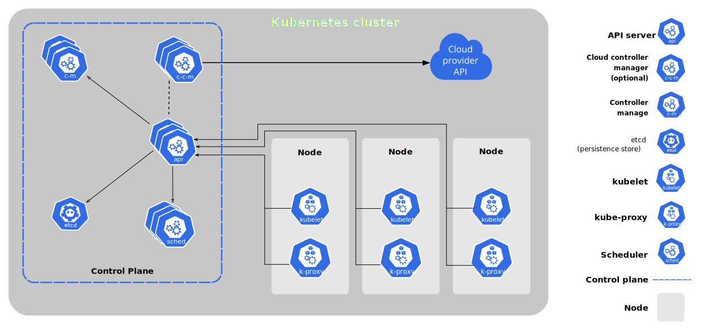

# Kubernetes 组件

当部署完 Kubernetes，即拥有了一个完整的集群。

一个 Kubernetes 集群由一组被称作节点的机器组成。这些节点上运行 Kubernetes 所管理的容器化应用。集群具有至少一个工作节点。

工作节点托管作为应用负载的组件的 Pod。控制平台管理集群中的工作节点和 Pod。为集群提供故障转移和高可用性，这些控制平台一般跨多主机运行，集群跨多个节点运行。

本文档概述了将会正常运行的 Kubernetes 集群所需的各种组件。

这张图表展示了包含所有相互关联组件的 Kubernetes 集群。

## 控制平面组件（Control Plane Components）

控制平面的组件对集群做出全局决策（例如：调度），以及检测和响应集群事件（例如：当部署的副本数量不满足时启动新的 pod）。

控制平面组件可以在集群的任何机器上运行。但是为了简单起见，通常会在同一台机器上启动所有控制平面组件，并且不在该机器上运行运行用户容器。
